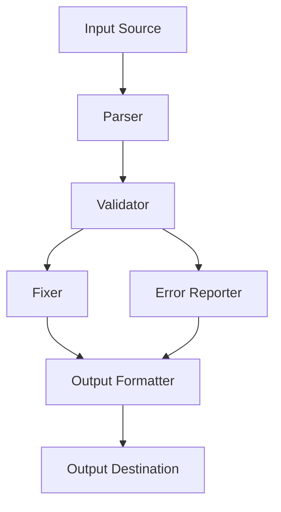

# Design Document: RDFormat Validator

## Overview

The RDFormat Validator is a NodeJS library and CLI tool designed to validate JSON data against the Reviewdog Diagnostic Format specification. The system will provide functionality to validate input, report detailed errors, and optionally fix common issues in the input data. The design focuses on creating a modular, maintainable, and user-friendly tool that can be used both as a library and as a command-line utility.

## Architecture

The system will follow a modular architecture with clear separation of concerns:



### Core Components

1. **Parser**: Handles reading and parsing input from various sources (files, stdin, strings).
2. **Validator**: Contains the logic for validating the parsed data against the RDFormat schema.
3. **Error Reporter**: Formats and outputs validation errors in a consistent format.
4. **Fixer**: Implements logic to automatically fix common issues in the input data.
5. **Output Formatter**: Formats the validation results or fixed data for output.

### Data Flow

1. Input is received from a file, stdin, or as a string when used as a library.
2. The parser converts the input into a JavaScript object.
3. The validator checks the object against the RDFormat schema.
4. If validation fails, errors are collected and passed to the error reporter.
5. If the fix option is enabled, the fixer attempts to correct issues in the data.
6. The output formatter prepares the results (errors or fixed data) for output.
7. Results are sent to the specified destination (stdout, file, or returned as an object).

## Components and Interfaces

### Parser Module

```typescript
interface ParserOptions {
  allowComments?: boolean;
  strictMode?: boolean;
}

interface ParserResult {
  data: any;
  success: boolean;
  errors?: ParseError[];
}

interface ParseError {
  message: string;
  line?: number;
  column?: number;
}

class Parser {
  constructor(options?: ParserOptions);
  parseString(input: string): ParserResult;
  parseFile(filePath: string): Promise<ParserResult>;
  parseStream(stream: ReadableStream): Promise<ParserResult>;
}
```

### Validator Module

```typescript
interface ValidationOptions {
  strictMode?: boolean;
  allowExtraFields?: boolean;
}

interface ValidationResult {
  valid: boolean;
  errors: ValidationError[];
  warnings: ValidationWarning[];
}

interface ValidationError {
  path: string;
  message: string;
  code: string;
  value?: any;
  expected?: string;
}

interface ValidationWarning {
  path: string;
  message: string;
  code: string;
}

class Validator {
  constructor(options?: ValidationOptions);
  validate(data: any): ValidationResult;
  validateField(path: string, value: any, schema: any): ValidationResult;
}
```

### RDFormat Schema

The validator will use a schema definition that represents the Reviewdog Diagnostic Format specification based on the official protobuf definition:

```typescript
interface RDFormatSchema {
  type: 'object';
  required: string[];
  properties: {
    [key: string]: {
      type: string;
      required?: string[];
      properties?: any;
      items?: any;
    };
  };
}

// Schema based on the official protobuf definition
const rdformatSchema = {
  type: 'object',
  properties: {
    diagnostics: {
      type: 'array',
      items: {
        type: 'object',
        required: ['message', 'location'],
        properties: {
          message: { type: 'string' },
          location: {
            type: 'object',
            required: ['path'],
            properties: {
              path: { type: 'string' },
              range: {
                type: 'object',
                properties: {
                  start: {
                    type: 'object',
                    required: ['line'],
                    properties: {
                      line: { type: 'number' },
                      column: { type: 'number' }
                    }
                  },
                  end: {
                    type: 'object',
                    properties: {
                      line: { type: 'number' },
                      column: { type: 'number' }
                    }
                  }
                }
              }
            }
          },
          severity: { 
            type: 'string', 
            enum: ['UNKNOWN_SEVERITY', 'ERROR', 'WARNING', 'INFO'] 
          },
          source: {
            type: 'object',
            required: ['name'],
            properties: {
              name: { type: 'string' },
              url: { type: 'string' }
            }
          },
          code: {
            type: 'object',
            properties: {
              value: { type: 'string' },
              url: { type: 'string' }
            }
          },
          suggestions: {
            type: 'array',
            items: {
              type: 'object',
              required: ['text', 'range'],
              properties: {
                range: { 
                  type: 'object',
                  properties: {
                    start: {
                      type: 'object',
                      properties: {
                        line: { type: 'number' },
                        column: { type: 'number' }
                      }
                    },
                    end: {
                      type: 'object',
                      properties: {
                        line: { type: 'number' },
                        column: { type: 'number' }
                      }
                    }
                  }
                },
                text: { type: 'string' }
              }
            }
          },
          original_output: { type: 'string' },
          related_locations: {
            type: 'array',
            items: {
              type: 'object',
              required: ['location'],
              properties: {
                message: { type: 'string' },
                location: {
                  type: 'object',
                  required: ['path'],
                  properties: {
                    path: { type: 'string' },
                    range: { type: 'object' }
                  }
                }
              }
            }
          }
        }
      }
    },
    source: {
      type: 'object',
      required: ['name'],
      properties: {
        name: { type: 'string' },
        url: { type: 'string' }
      }
    },
    severity: { 
      type: 'string', 
      enum: ['UNKNOWN_SEVERITY', 'ERROR', 'WARNING', 'INFO'] 
    }
  }
};
```

### Fixer Module

```typescript
interface FixerOptions {
  strictMode?: boolean;
  fixLevel?: 'basic' | 'aggressive';
}

interface FixResult {
  fixed: boolean;
  data: any;
  appliedFixes: AppliedFix[];
  remainingErrors: ValidationError[];
}

interface AppliedFix {
  path: string;
  message: string;
  before: any;
  after: any;
}

class Fixer {
  constructor(options?: FixerOptions);
  fix(data: any, validationResult: ValidationResult): FixResult;
  canFix(error: ValidationError): boolean;
  applyFix(data: any, error: ValidationError): AppliedFix | null;
}
```

### CLI Module

```typescript
interface CLIOptions {
  fix?: boolean;
  output?: string;
  verbose?: boolean;
  silent?: boolean;
  format?: 'json' | 'text';
  allowExtraFields?: boolean;
  strictMode?: boolean;
}

class CLI {
  constructor();
  parseArguments(args: string[]): CLIOptions;
  run(options: CLIOptions): Promise<number>;
  processFile(filePath: string, options: CLIOptions): Promise<void>;
  processStdin(options: CLIOptions): Promise<void>;
  outputResult(result: any, options: CLIOptions): Promise<void>;
}
```

### Library API

```typescript
interface RDFormatValidatorOptions {
  strictMode?: boolean;
  allowExtraFields?: boolean;
  fixLevel?: 'basic' | 'aggressive';
}

interface RDFormatValidatorResult {
  valid: boolean;
  errors: ValidationError[];
  warnings: ValidationWarning[];
  fixedData?: any;
  appliedFixes?: AppliedFix[];
}

class RDFormatValidator {
  constructor(options?: RDFormatValidatorOptions);
  
  // Main validation methods
  validateString(input: string, fix?: boolean): Promise<RDFormatValidatorResult>;
  validateFile(filePath: string, fix?: boolean): Promise<RDFormatValidatorResult>;
  validateObject(data: any, fix?: boolean): RDFormatValidatorResult;
  
  // Utility methods
  getSchema(): RDFormatSchema;
  setOptions(options: RDFormatValidatorOptions): void;
}

// Export functions for simpler usage
function validate(input: string | object, options?: RDFormatValidatorOptions): Promise<RDFormatValidatorResult>;
function validateAndFix(input: string | object, options?: RDFormatValidatorOptions): Promise<RDFormatValidatorResult>;
```

## Data Models

### RDFormat Data Model

The system will use TypeScript interfaces to define the structure of valid RDFormat data based on the official protobuf definition:

```typescript
// Top-level result format
interface DiagnosticResult {
  diagnostics: Diagnostic[];
  source?: Source;
  severity?: Severity;
}

// Individual diagnostic format (can be used in JSONL format)
interface Diagnostic {
  message: string;
  location: Location;
  severity?: Severity;
  source?: Source;
  code?: Code;
  suggestions?: Suggestion[];
  original_output?: string;
  related_locations?: RelatedLocation[];
}

enum Severity {
  UNKNOWN_SEVERITY = 'UNKNOWN_SEVERITY',
  ERROR = 'ERROR',
  WARNING = 'WARNING',
  INFO = 'INFO'
}

interface Location {
  path: string;
  range?: Range;
}

interface RelatedLocation {
  message?: string;
  location: Location;
}

interface Range {
  start: Position;
  end?: Position;
}

interface Position {
  line: number;
  column?: number;
}

interface Suggestion {
  range: Range;
  text: string;
}

interface Source {
  name: string;
  url?: string;
}

interface Code {
  value: string;
  url?: string;
}
```

### Validation Error Model

```typescript
interface ValidationError {
  path: string;        // JSON path to the error location
  message: string;     // Human-readable error message
  code: string;        // Error code for programmatic handling
  value?: any;         // The value that caused the error
  expected?: string;   // Description of expected value/format
}
```

### Fix Operation Model

```typescript
interface FixOperation {
  type: 'add' | 'remove' | 'replace';
  path: string;
  value?: any;
}
```

## Error Handling

The system will implement a comprehensive error handling strategy:

1. **Validation Errors**: Structured errors that occur during validation, with path information to locate the error in the input.
2. **System Errors**: Errors that occur during file operations, parsing, etc., which will be caught and reported appropriately.
3. **Edge Cases**: Special handling for common edge cases like empty input, malformed JSON, etc.

### Error Reporting Format

Validation errors will be reported in a consistent format:

```json
{
  "valid": false,
  "errors": [
    {
      "path": "diagnostics[0].location",
      "message": "Missing required property: path",
      "code": "REQUIRED_PROPERTY",
      "expected": "object with required property 'path'"
    }
  ],
  "warnings": [
    {
      "path": "source.extra",
      "message": "Unknown property: extra",
      "code": "UNKNOWN_PROPERTY"
    }
  ]
}
```

### Error Handling Strategy

1. **Early Validation**: Validate input format before deep validation to provide better error messages.
2. **Comprehensive Reporting**: Report all errors found, not just the first one.
3. **Contextual Information**: Include context in error messages to help users understand and fix issues.
4. **Graceful Degradation**: Handle unexpected errors gracefully without crashing.
5. **Clear Exit Codes**: Use appropriate exit codes in CLI mode to indicate success/failure.

## Testing Strategy

The testing strategy will cover multiple aspects of the system:

### Unit Testing

1. **Parser Tests**: Test parsing of valid and invalid JSON inputs.
2. **Validator Tests**: Test validation against various valid and invalid RDFormat structures.
3. **Fixer Tests**: Test automatic fixing of common issues.
4. **CLI Tests**: Test command-line argument parsing and execution.

### Integration Testing

1. **End-to-End Tests**: Test the complete flow from input to output.
2. **File I/O Tests**: Test reading from files and writing to files.
3. **Stream Processing Tests**: Test processing input from streams.

### Edge Case Testing

1. **Empty Input**: Test handling of empty input.
2. **Malformed JSON**: Test handling of malformed JSON.
3. **Large Files**: Test performance with large input files.
4. **Special Characters**: Test handling of Unicode and special characters.
5. **Deep Nesting**: Test handling of deeply nested structures.

### Test Fixtures

The system will include a set of test fixtures:

1. **Valid RDFormat Examples**: Examples of valid RDFormat data.
2. **Invalid RDFormat Examples**: Examples of invalid RDFormat data with specific issues.
3. **Edge Case Examples**: Examples that test edge cases.

## Implementation Considerations

### Performance Optimization

1. **Streaming Parser**: Use streaming JSON parsing for large files to minimize memory usage.
2. **Lazy Validation**: Validate only what's needed based on the context.
3. **Caching**: Cache validation results for repeated validations.

### Security Considerations

1. **Input Validation**: Validate all input to prevent injection attacks.
2. **Resource Limits**: Implement limits on input size and processing time.
3. **Safe File Operations**: Use safe file operations to prevent path traversal attacks.

### Extensibility

1. **Plugin System**: Design for extensibility to allow custom validators and fixers.
2. **Configuration Options**: Provide configuration options for customizing behavior.
3. **Hooks**: Implement hooks for extending functionality at key points.

## Deployment and Distribution

### Package Structure

```
rdformat-validator/
├── src/
│   ├── index.ts           # Main entry point
│   ├── parser/            # Parser module
│   ├── validator/         # Validator module
│   ├── fixer/             # Fixer module
│   ├── cli/               # CLI module
│   └── types/             # TypeScript type definitions
├── test/                  # Test files
├── fixtures/              # Test fixtures
├── dist/                  # Compiled output
├── bin/                   # CLI executable
├── package.json           # Package configuration
├── tsconfig.json          # TypeScript configuration
└── README.md              # Documentation
```

### NPM Package Configuration

```json
{
  "name": "rdformat-validator",
  "version": "1.0.0",
  "description": "Validator for Reviewdog Diagnostic Format",
  "main": "dist/index.js",
  "types": "dist/index.d.ts",
  "bin": {
    "rdformat-validator": "bin/rdformat-validator.js"
  },
  "scripts": {
    "build": "tsc",
    "test": "jest",
    "lint": "eslint src/**/*.ts"
  },
  "keywords": [
    "reviewdog",
    "validator",
    "diagnostic",
    "format",
    "json"
  ],
  "engines": {
    "node": ">=14.0.0"
  }
}
```

### Distribution Strategy

1. **NPM Package**: Publish as an NPM package for library usage.
2. **Global Installation**: Support global installation for CLI usage.
3. **Docker Image**: Provide a Docker image for containerized usage.

## Documentation Plan

### README Structure

1. **Introduction**: Overview of the tool and its purpose.
2. **Installation**: Instructions for installing as a library or CLI tool.
3. **Usage**: Examples of common usage patterns.
4. **API Reference**: Documentation of the library API.
5. **CLI Reference**: Documentation of CLI options.
6. **RDFormat Reference**: Brief overview of the Reviewdog Diagnostic Format.
7. **Contributing**: Guidelines for contributing to the project.

### API Documentation

Generate API documentation from TypeScript interfaces and JSDoc comments using TypeDoc.

### CLI Documentation

Include a `--help` option in the CLI that displays usage information and available options.

### Examples

Provide examples for common use cases:

1. **Basic Validation**: Validating a file against the RDFormat specification.
2. **Automatic Fixing**: Fixing common issues in RDFormat data.
3. **Library Usage**: Using the validator as a library in a NodeJS project.
4. **Integration**: Integrating the validator into CI/CD pipelines.